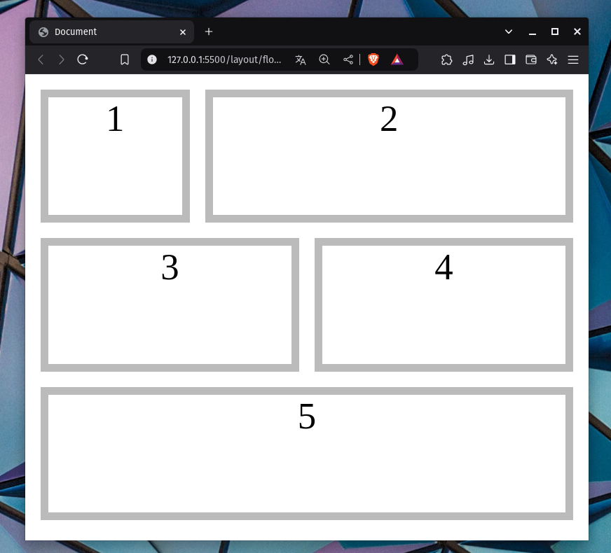
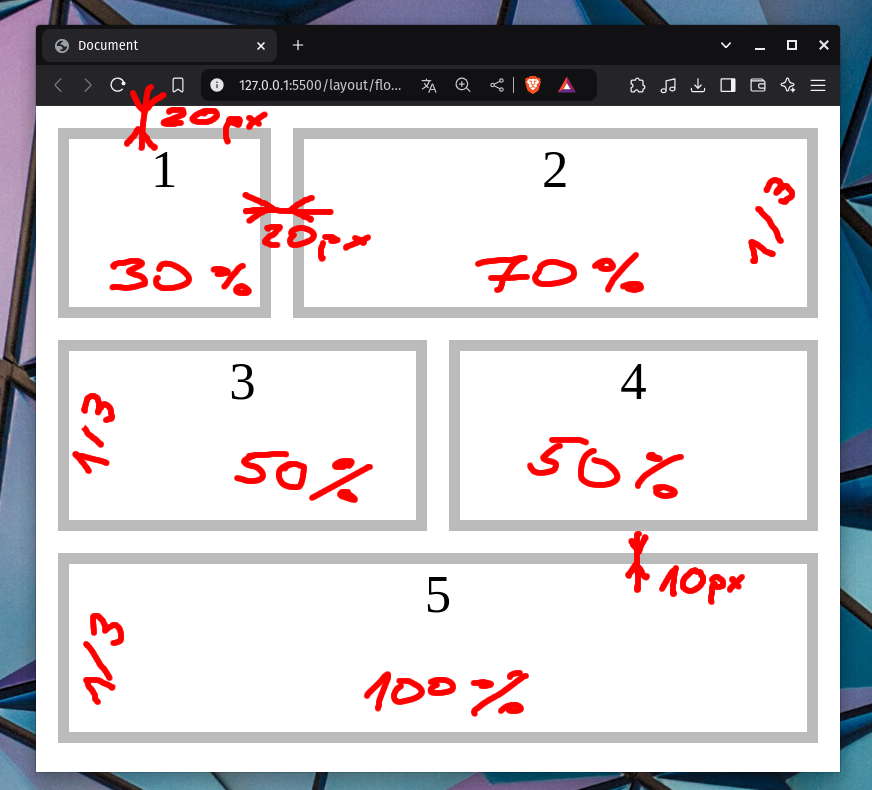
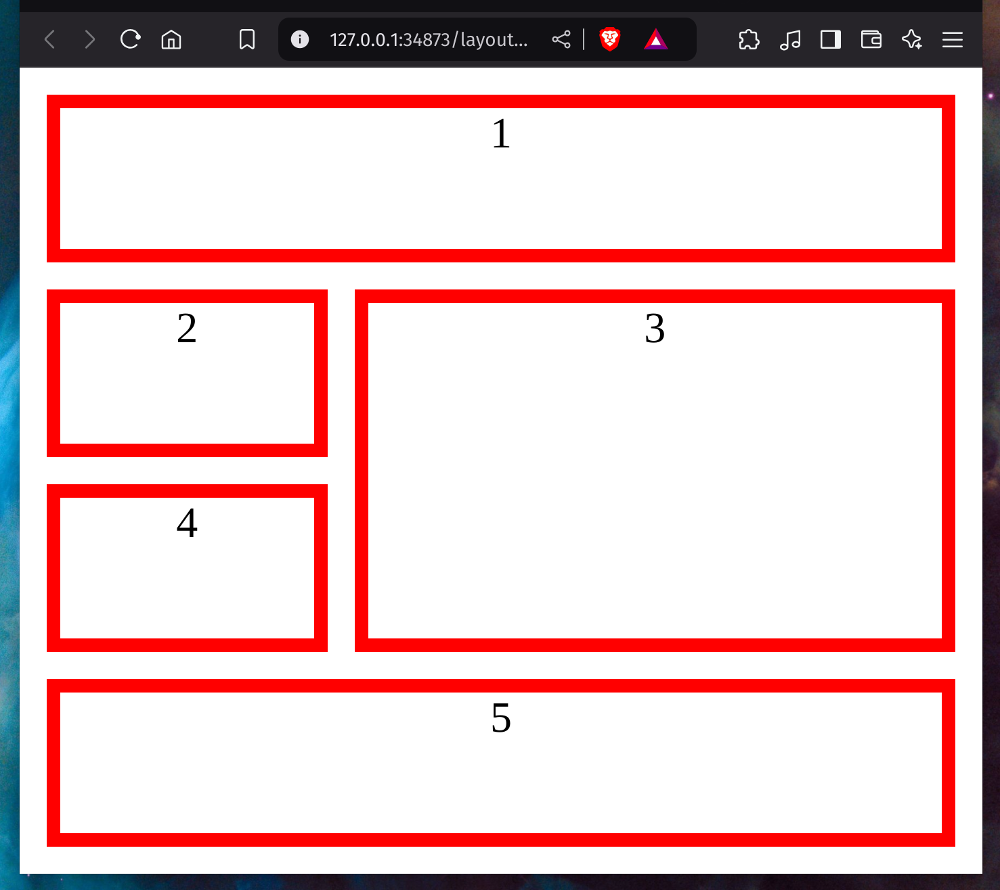
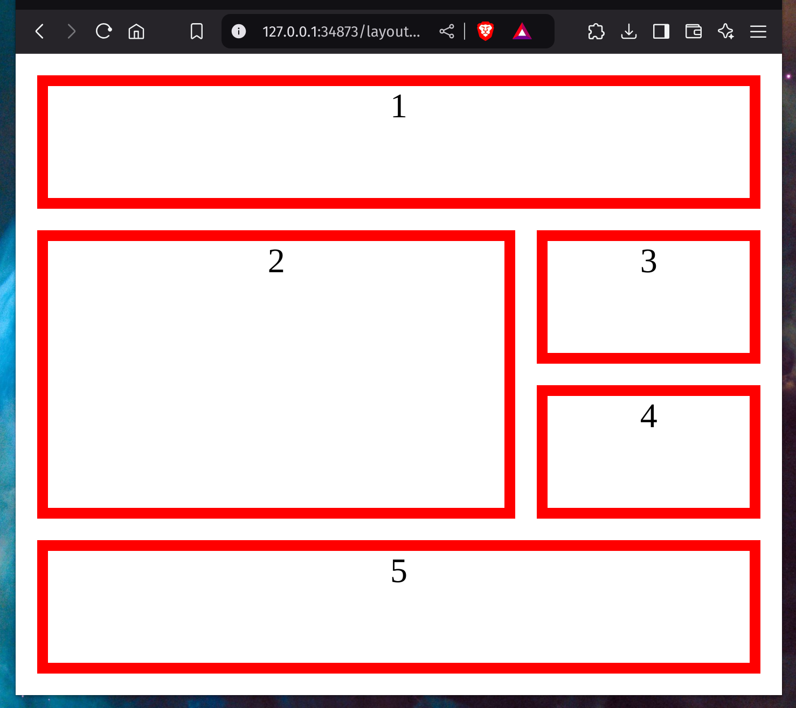
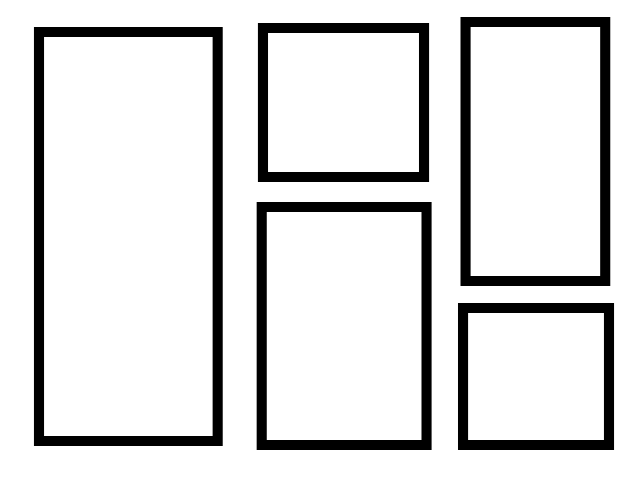

# PITSI320-Sprawdzian

### Sprawdzian 2024.11.12

Odwzoruj dokładnie poniższy layout strony przy pomocy css:float nie zmieniając zawartości body przestawionej poniżej:

CZAS PRACY: 25min

- grubość obramowania elementów: 10px
- odległości między elementami: 20px
- odległości między elementami a krawędziami obszaru aktywnego przeglądarki: 20px
- responsywność działająca jak na ostatnim obrazie.

```html
<body>
    <div id="pierwszy">1</div>
    <div id="drugi">2</div>
    <div id="trzeci">3</div>
    <div id="czwarty">4</div>
    <div id="piąty">5</div>
</body>
```











