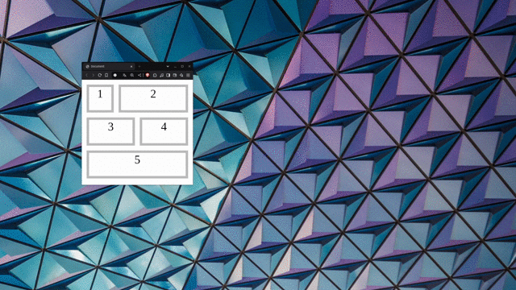

# PITSI320-Sprawdzian

### Sprawdzian

Odwzoruj poniższy layout strony nie zmieniając zawartości body przestawioną poniżej:

```html
<body>
    <div id="pierwszy">1</div>
    <div id="drugi">2</div>
    <div id="trzeci">3</div>
    <div id="czwarty">4</div>
    <div id="piąty">5</div>
</body>
```



